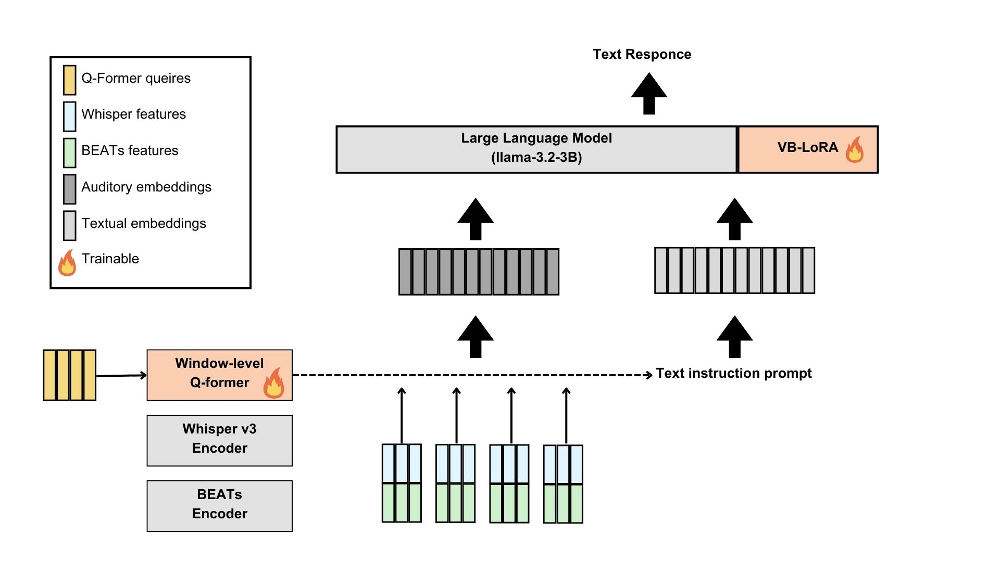
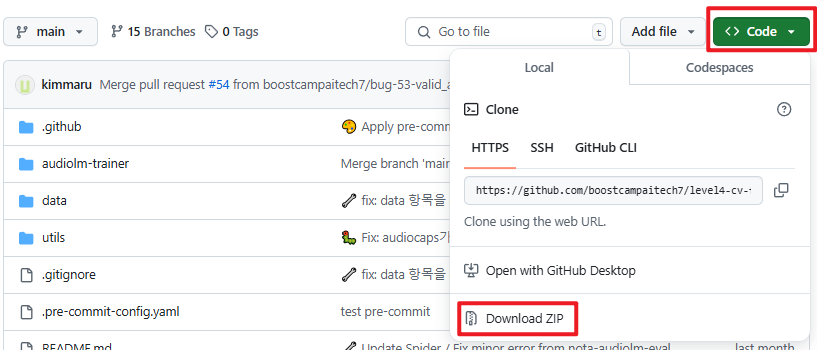

# 오디오 언어모델의 경량 모델링 
이 레포지토리는 오디오 언어 모델의 경량화를 목표로 합니다. Audio Adapter 결합과 사전 학습을 활용하여, 언어 모델이 음성, 음악, 환경음 등 다양한 소리를 이해하고 여러 다운스트림 작업을 수행할 수 있도록 합니다.

특히, VRAM이 제한된 환경에서도 원활하게 동작할 수 있도록 최적화하는 것이 핵심입니다. 이를 통해, Audio Understanding 벤치마크에서 기존 baseline 모델의 정확도를 유지하면서도, 더 작고 빠른 모델을 개발하는 것을 목표로 합니다.

본 모델은 [SALMONN](https://github.com/bytedance/SALMONN)을 변형한 버전으로 사용하고 있습니다.
## 모델의 구조


## 실행 방법

### 초기 설정 방법

**1. 현재 보고 있는 폴더를 다운로드 받습니다.**
```bash
git clone https://github.com/boostcampaitech7/level4-cv-finalproject-hackathon-cv-20-lv3.git
```
Git이 설치되어 있지 않은 경우, 저장소 상단의 "Code" 버튼을 클릭한 뒤 "Download ZIP" 버튼을 눌러주세요.
다운로드된 ZIP 파일을 원하는 폴더에 압축 해제하면 사용할 수 있습니다.



**2. 올바른 python을 설치합니다.**

본 레포지토리는 `python 3.10.16`을 사용하고 있습니다.

>기존에 Python이 설치되어 있다면 가상 환경에서 다른 버전을 사용하는 것을 권장드립니다.
> 현 프로젝트는 venv 가상환경으로 돌렸을 시 문제 없이 잘 동작합니다.

**3. 설치한 폴더에서 필요한 패키지를 설치합니다.**

이 과정은 프로젝트 실행에 필요한 환경을 설정하는 단계입니다.

```bash
pip install -r audiolm-trainer/requirements.txt
pip install -r requirements.txt
aac-metrics-download
```

**4. 각 모델에 해당하는 파일을 다운받고, 해당 설정 파일에서 경로를 지정합니다.**

- [whisper_v3](https://huggingface.co/openai/whisper-large-v3/tree/main)를 다운받고, 설정 파일의 `whisper_path`에 다운받은 경로를 넣습니다.
- [Fine-tuned BEATs_iter3+ (AS2M) (cpt2)](https://1drv.ms/u/s!AqeByhGUtINrgcpj8ujXH1YUtxooEg?e=E9Ncea)를 다운받고, 설정 파일의 `beat_path`에 다운받은 경로를 넣습니다.
- [meta-llama/Llama-3.2-3B-Instruct](https://huggingface.co/meta-llama/Llama-3.2-3B-Instruct/tree/main)를 다운받고, 설정 파일의 `llama_path`에 다운받은 경로를 넣습니다.

그 외 설치 중 문제가 발생했을 경우 `Issues > New Issue`에 남겨주시면 해결을 도와드리겠습니다.

### 모델을 학습(Train)시키는 방법
train하는 코드는 `audiolm-trainer`에서 실행시킬 수 있습니다.
```bash
cd audiolm-trainer
```
추가적으로 저희가 학습한 모델과 다른 설정을 원하신다면 `configs` 폴더를 참고해주세요. 학습 파라미터를 설정할 수 있습니다.\
현재 저희의 모델은 분산 처리할 수 있도록 구성되어있습니다.


**분산 처리를 원하는 경우**

```bash
torchrun --nproc_per_node=[분산 처리 할 gpu개수] train.py --cfg-path [config 파일 위치] 
```

**분산 처리를 원하지 않는 경우**
```bash
RANK=0 CUDA_VISIBLE_DEVICES=[gpu 번호] python train.py --cfg-path [config 파일 위치]
```
프로그램의 로그를 위한 wandb는 이 프로세스가 주 프로세스임을 상정하고 구현되어있습니다. \
따라서 RANK=0를 설정하지 않는다면, wandb에서 에러가 발생할 수 있습니다.

### 평가(Evaluate)
모델로 추론을 진행한 후 평가 메트릭에 맞춰 점수를 산정합니다.
반드시 `pwd`를 사용해 현재 위치가 `level4-cv-finalproject-hackathon-cv-20-lv3`에 있는지 확인해주세요.
```bash
pwd # 결과값 ~/level4-cv-finalproject-hackathon-cv-20-lv3
```
모든 annotation은 다음과 같은 형태를 가지고 있어야 합니다.

```json
{
  "annotation": [
    {
      "testset_id": "any_id_for_test", # testset에 부여되는 id
      "path": "/path/to/audio_file", # audio파일이 저장된 경로
      "task": [asr,audiocaption_v2], # task
    },
    ...
```

평가를 위한 코드는 총 2개입니다.
- `evaluate_salmonn.py`: asr/aac를 평가
- `evaluate_efficiency_salmonn.py`: Latency/time(TTFT/TTOT)를 평가

`salmonn_eval_config.yaml` 에서 데이터셋 경로, 모델 경로 등을 적절히 수정한 후 상황에 따라 둘 중 하나의 스크립트를 실행합니다.

**asr/aac 평가**

```bash
python evaluate_salmonn.py --mode [submission_asr, submission_aac, valid_asr, valid_aac] --cfg-path [config 파일 위치]
```

- `submission_asr`과 `submission_aac`는 csv를 만들기 위한 모드입니다.
- `valid_asr`, `valid_aac`는 자체적인 평가를 진행하고자 할 때 사용합니다. 
- submission과 valid는 서로 다른 디렉토리에 csv 파일이 저장됩니다.
- `--cfg-path`를 생략할 경우 salmonn_eval_config.yaml이 기본값으로 실행됩니다.

**Latency/Time 평가하기**

```bash
python evaluate_efficiency_salmonn.py --cfg-path [config 파일 위치]
```


## Validate submission file
```python
python submission_validator.py /path/to/submission.csv
```

위 스크립트는 파일의 형식만 확인하며, 샘플의 개수는 validation하지 않습니다.